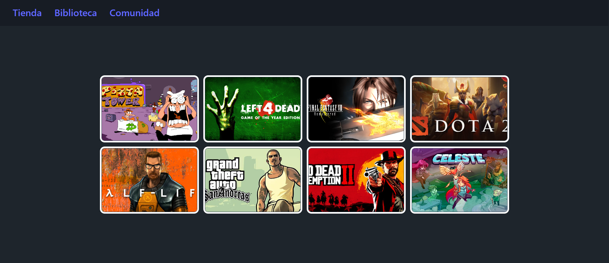

# JAVASCRIPT CON REACT: CREACION BASICA DE LA PLATAFORMA DE JUEGOS STEAM

## Renderizacion de datos de juegos en React desde JSON

El archivo 'app.jsx' importa estilos CSS y la carpeta de componentes Juegos desde ubicaciones especificas dentro del proyecto. Utiliza datos de juegos almacenados en un archivo JSON (game.json), iterando sobre cada juego para crear dinamicamente componentes con propiedades unicas como url, titulo, y descripcion. Estos componentes se renderizan en la interfaz de la aplicación React mientras que los datos originales se imprimen en la consola del navegador para verificar su correcta carga y estructura.

```jsx
import './App.css';
import { Juegos } from './assets/Components/Juegos.jsx';
import Json from './../game.json';

function App() {

  const Juego = [];

  Json.STEAM.JUEGOS.forEach(function(v){
     Juego.push(
      <Juegos
        key={v.url} 
        url={v.url}
        titulo={v.titulo}
        descripcion={v.descripcion}
      />
    );
  });

  console.log(Json.STEAM.JUEGOS);
  return (
    <>
      <nav>
        <ul>
          <li><a href="#">Tienda</a></li>
          <li><a href="#">Biblioteca</a></li>
          <li><a href="#">Comunidad</a></li>
        </ul>
      </nav>
      <div className='Steam'>
        {Juego} 
      </div>
    </>
  );
}

export default App;
```


## Datos JSON de Juegos de Steam

En mi JSON describe una lista de juegos de la plataforma Steam, cada uno representado como un objeto con detalles como la URL de la imagen de portada (url), el título del juego (titulo) y una descripción del juego (descripcion). Cada objeto dentro de la lista JUEGOS contiene esta información para mostrar características clave de cada juego.

```json
{
    "STEAM": {
      "JUEGOS": [
        {
          "url": "https://shared.akamai.steamstatic.com/store_item_assets/steam/apps/2231450/capsule_616x353.jpg?t=1712946444",
          "identificador": 37565884,
          "titulo": "Pizza Tower",
          "Año": "2019",
          "clasificación": "tv-13",
          "género": "acción",
          "director": "*****",
          "protagonistas": [
            "henry cavill",
            "amy adams"
          ],
          "descripcion": "Pizza Tower is a fast paced 2D platformer inspired by the Wario Land series, with an emphasis on movement, exploration and score attack."
        },
        {
          "url": "https://shared.akamai.steamstatic.com/store_item_assets/steam/apps/500/capsule_616x353.jpg?t=1718138026",
          "identificador": 189282,
          "titulo": "Left 4 Dead",
          "Año": "2020",
          "clasificación": "TV-MA",
          "género": "Drama",
          "director": "Francesco Amato",
          "protagonistas": [
            "Vittoria Puccini",
            "Benedetta Porcaroli",
            "Edoardo Leo"
          ],
          "descripcion": "De la mano de Valve llega Left 4 Dead, un juego cooperativo de acción y terror en el que hasta cuatro jugadores se enfrentan a hordas de zombis y a terroríficos monstruos mutantes en una épica lucha por la supervivencia."
        },
        {
          "url": "https://assets.nintendo.com/image/upload/ar_16:9,c_lpad,w_1240/b_white/f_auto/q_auto/ncom/software/switch/70010000019037/1f609577d7c4f00a85b762bb56fcec55f3ebba9b0ca77292ec11626f3d804dc2",
          "identificador": 142393,
          "titulo": "Final Fantasy VIII",
          "Año": "2019",
          "clasificación": "TV-MA",
          "género": "Suspenso",
          "director": "***",
          "protagonistas": [
            "Iván Massague",
            "Antonia San Juan",
            "Zorion"
          ],
          "descripcion": "Son tiempos de guerra. Galbadia, una superpotencia mundial, declara la guerra a Dollet, un país vecino cuya academia militar alberga a dos verdaderas personalidades: el exaltado Seifer y el lobo solitario Squall Leonhart"
        },
        {
          "url": "https://shared.akamai.steamstatic.com/store_item_assets/steam/apps/570/header.jpg?t=1719426369",
          "identificador": 948573,
          "titulo": "Dota 2",
          "Año": "2015",
          "clasificación": "PG-13",
          "género": "Drama",
          "director": "Nancy Meyers",
          "protagonistas": [
            "Anna hathaway",
            "Rene Russo"
          ],
          "descripcion": "Cada día, millones de jugadores de todo el mundo entran en batalla como uno de los más de cien héroes de Dota. Y no importa si es su décima hora de juego o la milésima, siempre hay algo nuevo que descubrir"
        },
        {
          "url": "https://shared.akamai.steamstatic.com/store_item_assets/steam/apps/70/header.jpg?t=1700269108",
          "identificador": 345672,
          "titulo": "Half-Life",
          "Año": "2017",
          "clasificación": "R",
          "género": "Acción",
          "director": "Chad Stahelski",
          "protagonistas": [
            "keanu Reeves",
            "Common",
            "Laurence"
          ],
          "descripcion": "Nombrado juego del año por más de 50 publicaciones, la ópera prima de Valve mezcla acción y aventuras con una tecnología galardonada con varios premios, en un mundo terriblemente realista en el que los jugadores deberán esforzarse por sobrevivir."
        },
        {
          "url": "https://i.blogs.es/92320d/650_1000_san-andreas-steam/650_1200.jpg",
          "identificador": 598374,
          "titulo": "Grand The Auto: San Andrés",
          "Año": "2019",
          "clasificación": "B15",
          "género": "Crime, Drama, Thriller",
          "director": "Todd Phillips",
          "protagonistas": [
            "Joaquin Phoenix",
            "Robert De Niro",
            "Zazie Beetz"
          ],
          "descripcion": "Hace cinco años, Carl Johnson escapó de las presiones de la vida en Los Santos, San Andreas... una ciudad desgarrada por los problemas de pandillas, las drogas y la corrupción. Donde las estrellas de cine y los millonarios hacen todo lo posible para evitar a los traficantes y pandilleros."
        },
        {
          "url": "https://shared.akamai.steamstatic.com/store_item_assets/steam/apps/1174180/header.jpg?t=1714055653",
          "identificador": 345672,
          "titulo": "Red Dead Redemption 2",
          "Año": "2017",
          "clasificación": "R",
          "género": "Acción",
          "director": "Chad Stahelski",
          "protagonistas": [
            "keanu Reeves",
            "Common",
            "Laurence"
          ],
          "descripcion": "Con más de 175 premios al Juego del año y más de 250 valoraciones perfectas, Red Dead Redemption 2 es la épica historia de Arthur Morgan y la banda de Van der Linde, que huyen por toda América en el albor de una nueva era. También incluye acceso al mundo multijugador compartido de Red Dead Online."
        },
        {
          "url": "https://gaming-cdn.com/images/products/8003/orig/celeste-pc-mac-juego-steam-cover.jpg?v=1705489821",
          "identificador": 345672,
          "titulo": "Celeste",
          "Año": "2017",
          "clasificación": "R",
          "género": "Acción",
          "director": "Chad Stahelski",
          "protagonistas": [
            "keanu Reeves",
            "Common",
            "Laurence"
          ],
          "descripcion": "Ayuda a Madeline a sobrevivir a los demonios de su interior en su viaje hasta la cima de la montaña Celeste, en este ajustadísimo plataforma, obra de los creadores de TowerFall. Enfréntate a cientos de desafíos diseñados a mano, devela retorcidos secretos y, y reconstruye el misterio de la montaña."
        }
      ]
    }
}
```

## Componentes 

En mi carpeta de 'Components' define un componente funcional de React llamado Juegos que está diseñado para mostrar información de un juego como su imagen (url), título (titulo) y descripción (descripcion). Este componente Juegos utiliza props destructuradas url, titulo, y descripcion para renderizar dinámicamente la información de cada juego en una estructura visual compuesta por una imagen y texto descriptivo.

```jsx
import './Juegos.css';

export const Juegos = ({url,titulo ,descripcion }) => {
    return (
        <>
            <div className="juego">
                
                <div className="container">
                    <p className="titulo">{titulo}</p>
                    <p className="description">{descripcion}</p>
                </div>
            </div>
        </>
    )
}
```



## Authors

- [@Mauricio Pereda Ruiz](https://github.com/MauriPereda05)